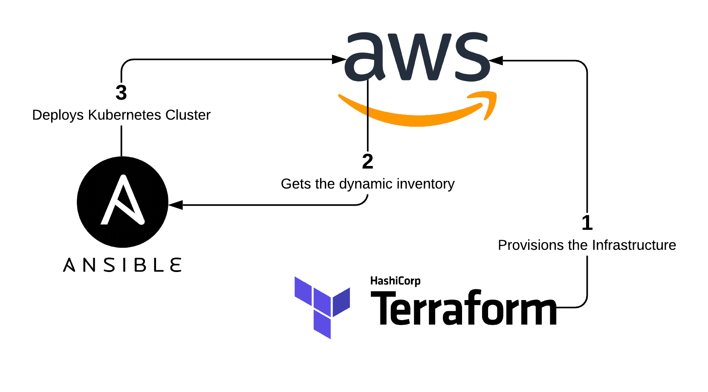

# kubernetes-cluster

:warning: This is a work in progress :warning:

## Table of Contents
1. [Overview](#Overview)
2. [Requirements](#Requirements)
3. [Settings](#Settings)
4. [To-do list](#to-do-list)

## Overview

_kubernetes-cluster_ deploys a fully-functional [Kubernetes](https://kubernetes.io/) Cluster in [AWS](https://aws.amazon.com/) using [Terraform](https://www.terraform.io) for provisioning and [Ansible](https://www.ansible.com) for configuration management.

AWS resources are provisioned by Terraform. Terraform state file is stored in AWS S3. Ansible's external dynamic inventory system gathers hosts data from the state file stored in S3 and deploys the Kubernetes cluster in the compute instances.

The Kubernetes cluster is composed by:
- Three etcd nodes
- Three Control Plane nodes
- At least three Worker nodes

The cluster is built taking into consideration AWS's high availability features. All nodes are distributed equally among three Availability Zones of a single region.

For simplicity and easy management purpose, _kubernetes-cluster_ uses a single [YAML](https://yaml.org/) configuration file to set all variables. A shell script calls [j2cli](https://github.com/kolypto/j2cli) which builds Terraform and Ansible configuration files based on [Jinja2](https://jinja.palletsprojects.com/) templates, fetching variables from that single configuration file.

## Requirements
- Terraform 0.12.17
- Ansible 2.9.1
- boto
- j2cli

## Settings

The settings are defined in the `settings.yml` file.

#### `aws.region`

- AWS Region
- Must have at least 3 Availability Zones

#### `aws.backend_s3.bucket`

- The bucket to store the state file
- _kubernetes_cluster_ does not handle bucket creation. Must be an existent bucket
- Reference: [https://www.terraform.io/docs/backends/types/s3.html#bucket](https://www.terraform.io/docs/backends/types/s3.html#bucket)

#### `aws.backend_s3.key`

- The path to store the Terraform state file inside the bucket
- _kubernetes_cluster_ does not handle path creation. Must be an existent path
- Reference: [https://www.terraform.io/docs/backends/types/s3.html#key](https://www.terraform.io/docs/backends/types/s3.html#key)

#### `aws.backend_s3.region`

- The region of the AWS S3 Bucket where the Terraform state file will be stored
- Reference: [https://www.terraform.io/docs/backends/types/s3.html#region](https://www.terraform.io/docs/backends/types/s3.html#region)

#### `aws.ssh_key.key_name`

- Reference: [https://www.terraform.io/docs/providers/aws/r/key_pair.html#key_name](https://www.terraform.io/docs/providers/aws/r/key_pair.html#key_name)

#### `aws.ssh_key.public_key`

- Reference: [https://www.terraform.io/docs/providers/aws/r/key_pair.html#public_key](https://www.terraform.io/docs/providers/aws/r/key_pair.html#public_key)

#### `aws.network.vpc_cidr_block`

- Reference: [https://www.terraform.io/docs/providers/aws/r/vpc.html#cidr_block](https://www.terraform.io/docs/providers/aws/r/vpc.html#cidr_block)

#### `aws.network.subnet_a.cidr_block`

- Subnet A CIDR Block
- Reference: [https://www.terraform.io/docs/providers/aws/r/subnet.html#cidr_block](https://www.terraform.io/docs/providers/aws/r/subnet.html#cidr_block)

#### `aws.network.subnet_a.availability_zone`

- Subnet A Availability Zone
- Reference: [https://www.terraform.io/docs/providers/aws/r/subnet.html#availability_zone](https://www.terraform.io/docs/providers/aws/r/subnet.html#availability_zone)

#### `aws.network.subnet_b.cidr_block`

- Subnet B CIDR Block
- Reference: [https://www.terraform.io/docs/providers/aws/r/subnet.html#cidr_block](https://www.terraform.io/docs/providers/aws/r/subnet.html#cidr_block)

#### `aws.network.subnet_b.availability_zone`

- Subnet B Availability Zone
- Reference: [https://www.terraform.io/docs/providers/aws/r/subnet.html#availability_zone](https://www.terraform.io/docs/providers/aws/r/subnet.html#availability_zone)

#### `aws.network.subnet_c.cidr_block`

- Subnet C CIDR Block
- Reference: [https://www.terraform.io/docs/providers/aws/r/subnet.html#cidr_block](https://www.terraform.io/docs/providers/aws/r/subnet.html#cidr_block)

#### `aws.network.subnet_c.availability_zone`

- Subnet C Availability Zone
- Reference: [https://www.terraform.io/docs/providers/aws/r/subnet.html#availability_zone](https://www.terraform.io/docs/providers/aws/r/subnet.html#availability_zone)

#### `aws.nodes.etcd.instance_ami`

#### `aws.nodes.etcd.instance_type`

#### `aws.nodes.etcd.root_block_device_volume_size`

#### `aws.nodes.etcd.monitoring`

#### `aws.nodes.etcd.ebs_optimized`

#### `aws.nodes.control_plane.instance_ami`

#### `aws.nodes.control_plane.instance_type`

#### `aws.nodes.control_plane.root_block_device_volume_size`

#### `aws.nodes.control_plane.monitoring`

#### `aws.nodes.control_plane.ebs_optimized`

#### `aws.nodes.worker.instance_ami`

#### `aws.nodes.worker.instance_type`

#### `aws.nodes.worker.root_block_device_volume_size`

#### `aws.nodes.worker.nodes_per_az`

#### `aws.nodes.worker.monitoring`

#### `aws.nodes.worker.ebs_optimized`

#### `aws.load_balancer.kube_apiserver.idle_timeout`

#### `aws.load_balancer.kube_apiserver.connection_draining`

#### `aws.load_balancer.kube_apiserver.connection_draining_timeout`

#### `aws.load_balancer.kube_apiserver.instance_port`

#### `aws.load_balancer.kube_apiserver.lb_port`

#### `aws.load_balancer.kube_apiserver.health_check.healthy_threshold`

#### `aws.load_balancer.kube_apiserver.health_check.unhealthy_threshold`

#### `aws.load_balancer.kube_apiserver.health_check.timeout`

#### `aws.load_balancer.kube_apiserver.health_check.interval`

#### `ansible.config.remote_user`

#### `ansible.config.private_key_file`

#### `ansible.config.host_key_checking`

#### `ansible.config.interpreter_python`

#### `ansible.config.inventory`

#### `ansible.base.packages`

#### `ansible.docker.repository.key`

#### `ansible.docker.repository.source`

#### `ansible.docker.repository.packages`

#### `ansible.kubernetes.repository.key`

#### `ansible.kubernetes.repository.source`

#### `ansible.kubernetes.repository.packages`

## To-do list
- README.md :: boto
- README.md :: Document Ansible Dynamic Inventory - [link1](https://docs.ansible.com/ansible/latest/user_guide/intro_dynamic_inventory.html), [link2](https://raw.githubusercontent.com/ansible/ansible/devel/contrib/inventory/ec2.py), [link3](https://raw.githubusercontent.com/ansible/ansible/devel/contrib/inventory/ec2.ini)
- Add boto profiles support
- requirements.txt
- version.txt
- Replace the tag "kubernetes-cluster" by a variable
- boto profiles
- Add a bastion host
- Replace "master" by "control plane" (?)
- Terraform :: support placement groups
- Terraform :: ebs_optimized = true | _Error launching source instance: Unsupported: EBS-optimized instances are not supported for your requested configuration. Please check the documentation for supported configurations._
- Terraform :: Add public and private subnets. Move the cluster to a private subnet
- Terraform :: VPC, public and private subnets
- Terraform :: Compute/EBS additional options, like volume_type and IOPS to root_block_device
- Terraform :: Compute, set subnet_id instead availability_zone in instances
- Terraform :: Remote state locking with DynamoDB
- Terraform :: Appropriate Security Group rules
- Ansible :: Enforce Kubernetes packages version
- Ansible :: Enforce Kubernetes packages version
- Ansible :: Packages marked as on hold are still being upgraded (double-check if this is happening and fix it)
- Ansible :: Double-check if the _notifies_ are in the right place, order.
- Ansible :: Move _control_plane : apply Weave Net CNI plugin_ shell command to a variable
- Ansible :: Allow the choice of other CNI plugins (?)
